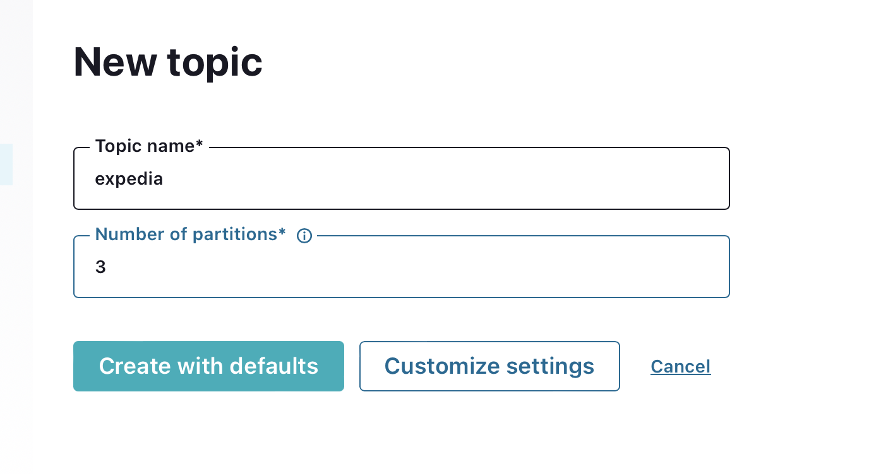

# Kafka Connect

Link to project repo - https://github.com/Mamba369x/M12_KafkaStreams_PYTHON_AZURE


## Prerequisites

- Azure CLI
- Terraform
- Python 3
- wget
- Make
- Jq

## Environment Variables

Before running the Makefile targets, ensure that the following environment variables are set:

- `TF_VAR_SUBSCRIPTION_ID`: Your Azure subscription ID

### Setting Environment Variables

#### On Mac and Linux

To set the environment variables on Mac or Linux, you can use the `export` command in the terminal:

```bash
export TF_VAR_SUBSCRIPTION_ID=<your_subscription_id>
```

## Example Usage

* Step 1: The first step involves unzipping provided data and uploading it into terraform infra.

```bash
make start
```


* Step 2: Create and push azure connector and kstream docker images

```bash
make build
```


* Step 3: Launch Confluent for Kubernetes

```bash
make conf
```


* Step 4: View Control Center

```bash
make run
```


- Browse to Control Center: [http://localhost:9021](http://localhost:9021)

* Step 5: Create kafka expedia and expedia_ext topics




* Step 6: Prepare the azure connector configuration


* Step 7: Upload the connector file through the API and observe messages flow


* Step 8: 

```bash
make 
```


* Step 9: Visualized data in Kafka topic

```bash
make 
```


kubectl delete pods --all --all-namespaces
cd ../stream && \
az acr build --registry $$ACR_NAME --image kstream-app:1.0 -f Dockerfile .


