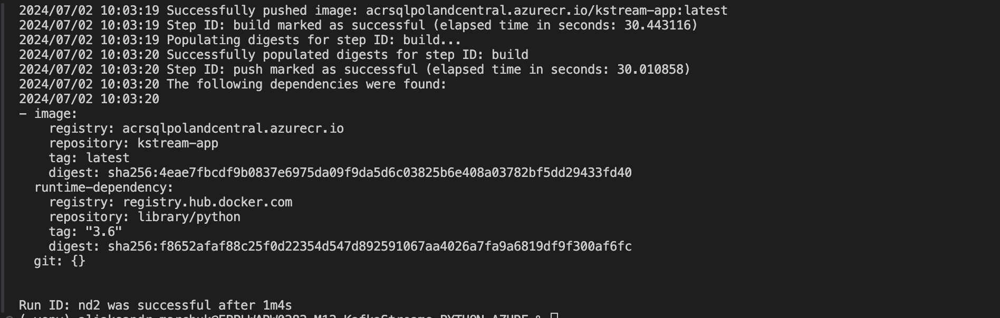

# Kafka Connect

Link to project repo - https://github.com/Mamba369x/M12_KafkaStreams_PYTHON_AZURE


## Prerequisites

- Azure CLI
- Terraform
- Python 3
- wget
- Make
- Jq

## Environment Variables

Before running the Makefile targets, ensure that the following environment variables are set:

- `TF_VAR_SUBSCRIPTION_ID`: Your Azure subscription ID

### Setting Environment Variables

#### On Mac and Linux

To set the environment variables on Mac or Linux, you can use the `export` command in the terminal:

```bash
export TF_VAR_SUBSCRIPTION_ID=<your_subscription_id>
```

## Example Usage

* Step 1: The first step involves unzipping provided data and uploading it into terraform infra.
(If you are on Mac ensure that .DS_Store file is not uploaded)

```bash
make start
```


* Step 2: Create and push azure connector and kstream docker images

```bash
make build
```



* Step 3: Launch Confluent for Kubernetes

```bash
make conf
```


* Step 4: Create kafka expedia and expedia_ext topics


* Step 5: Prepare the azure connector configuration


* Step 6: Upload the connector file through the API and observe messages flow


* Step 7: Create stream and table for hotels stats in ksqldb Confluent UI


* Step 8: Download confluent-6.1.0, forward connection from pod ksqldb-0 to local port 8088, run ./ksql http://localhost:8088 and visualized data in Kafka topic

```bash
make run
```


* Step 8: Visualized data in Kafka topic

```bash
make run
```


SELECT * FROM expedia EMIT CHANGES;


SELECT * FROM hotel_stats EMIT CHANGES;

